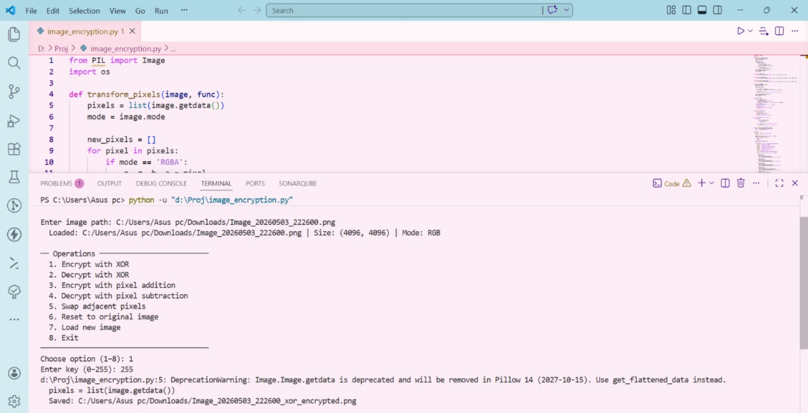

# Image Encryption Tool (Python)

A command-line tool that applies reversible pixel-level transformations to images using Python and Pillow.

## Overview

This project demonstrates simple, reversible operations on image data:

* XOR-based encryption and decryption
* Pixel value shifting using modular arithmetic (addition/subtraction)
* Adjacent pixel swapping

The tool supports RGB and RGBA images and preserves transparency.

## Before and After (XOR Encryption)

Original image

Encrypted image (XOR with key = 255)

## Code Snapshot

## How It Works

* XOR applies a bitwise operation to each color channel. Applying the same key again restores the original image.
* Addition and subtraction shift pixel values modulo 256.
* Pixel swapping rearranges adjacent pixels and is reversible.

## Requirements

* Python 3.x
* Pillow

Install dependencies:
pip install pillow

## Usage

Run the program:
python main.py

Then:

1. Enter the image path
2. Select an operation
3. Enter a key when prompted
4. The processed image is saved automatically

